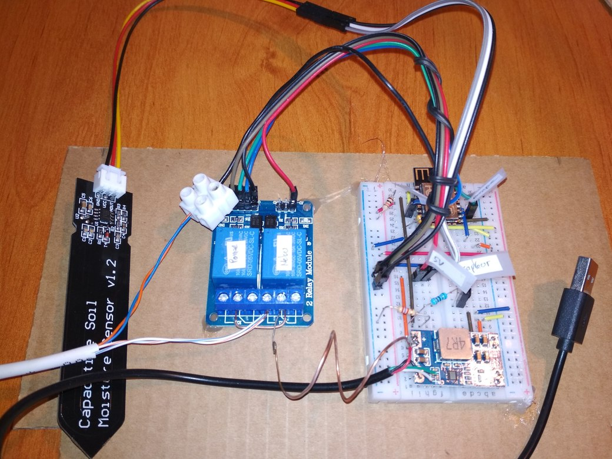
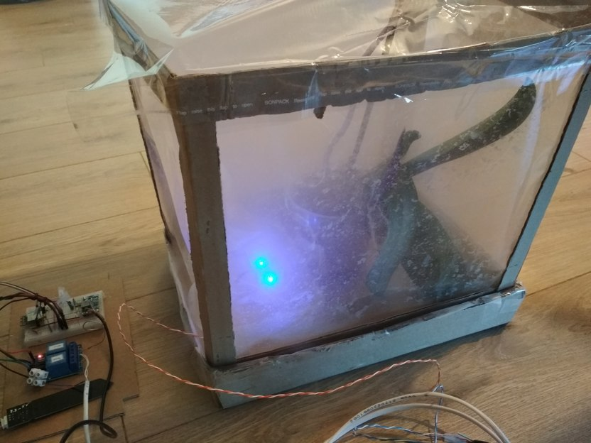

Self-watering garden proof of concept driven by MicroPython on ESP12 / ESP8266

    
    

## Overview

ESP modules are very versatile and carry enough RAM / flash memory to run
high level code written with MicroPython.

Here you will find a (functional) proof of concept of autonomous watering of
orchids and houseplants. The cost is a few euros.

See [programmation paragraph](#programmation) to know how the workflow works.

## Hardware requirements

- ESP-12F

    Based on a ESP8266; supporting network connectivity via WiFi.
    Associated or not with a development board.

- Capacitive Moisture Sensor

    

        
    

    This one is corrosion resistant. Contrary to resistive sensors, there are no metal parts (probes)
    exposed with the soil.
    Thus, there will be no oxidation due to electrolysis degrading the sensor in the short term.

- Nebulizer disc with capillary (Ø 20mm)

    

        
    

- USB mini pump

- Two low active relays are used:

    

        
    

    - for a classic pump
    - for water nebulizers

    PS: *Active high* relay is possible but will require a little modification in the code.

- Silicone/polyethylene pipes

## Assembly

    

    

### ESP generic pinout

- EN (CH_PD) Enable Pin has to be pulled up (R1)
    => resistance not / not very useful
- RESET Pin has to be pulled up (R3)
- GPIO15 has to be pulled down (R2)
    => must be LOW to boot
- GPIO2 has to be pulled up (R4)
    Internal pull-up is available and used
- GPIO0: Manual LOW for flash mode
- GPIO16: Connected to RST in order to use wakeups based on timers (deepsleep mode)

See more on [esp8266-pinout-reference-gpios](https://randomnerdtutorials.com/esp8266-pinout-reference-gpios/).

### Use case pinout

- Classic pump: Pin 2
- Water nebulizers: Pin 12
- Humidity sensor: ADC0

### Relays

| Relay pinout      | ESP pinout                | Description
| :---------------- | :------------------------ | :---------------------------- |
| IN1               | GPIO2 (OUTPUT)            | Control of the first relay    |
| IN2               | GPIO12 (OUTPUT)           | Control of the second relay   |
| right GND         | GND                       | Common ground                 |
| right VCC         | 3.3V                      | Optocoupler power supply      |
| left GND          | -                         | Common ground                 |
| JD-VCC            | 5V (USB)                  | Relays power supply           |

JD-VCC pin is optionally used to power the relay with a different voltage from
that of the optocoupler (ESP side). This will guarantee a perfect galvanic isolation.

### Water nebulizers

100uF capacitor shown on the seller's pictures is frequently missing.
It should limit noise on the power supply but everything seems to work without it.

### Moisture sensor

If the ESP12F/ESP12E support a maximum Input High Voltage (VIH) of 3.6V,
their analog-digital converter accepts a voltage range from 0 to 1V
([datasheet](https://docs.ai-thinker.com/_media/esp8266/docs/esp-12f_product_specification_en.pdf)).

> AD conversion,  Input  voltage  range 0-1V, the value range is 0-1024.

See also: [esp8266-adc-reading-analog-values-with-nodemcu](https://randomnerdtutorials.com/esp8266-adc-reading-analog-values-with-nodemcu/).

Contrary to what is mentioned everywhere on the web, the sensor must be supplied with
a minimum of 5V (does not work at 3.3V).
The NE555 circuit (timer), responsible for the output voltage, operates between 5 to 16V.
The datasheet indicates that the output voltage is however limited to 3.3V for a VCC of 5V.

However, some PCBs use the ICM7555 timer ([datasheet](https://www.nxp.com/docs/en/data-sheet/ICM7555.pdf))

> VOH: typical voltage: 4.5V for VCC 5V

Warning!!! In practice I have already measured 3.8 to 4V on this pin.

If you use a bare ESP device (not on dev board with an internal voltage divider)
you WILL need a voltage divisor for this sensor.
Adapt the voltage divider bridge to YOUR situation.

See calculator:

http://www.learningaboutelectronics.com/LesArticles/Calculatrice-diviseur-de-tension.php

Example of divisor bridge 4V => 1V:

    Sensor output --- R1 --- GPIO 1V --- R2 --- GND

    Vout_gpio = Vin_sensor * R2 / (R1 + R2)

    Let's choose R2 = 5K; R1 = 10K
    Or R2 = 2.6K; R1 = 5K

100% water:

    2.05V
    analogRead: 297

0% water:

    3.83-4V
    analogRead: 378

## Programmation

    

### Configuration

By default the module will wake up every 1 hour to check if something needs to be done
(the deep sleep timer cannot exceed this duration by much).
Nebulisators are triggered every 12hours for ~2minutes.
Pump is triggered every week; however a humidity check can postpone a trigger during
the 5 next days if humidity is satisfying.
Relay is triggered 2 times during 7s each, with a pause of 5 minutes.

For safety purpose, if case of reboot due to a power failure,
the pump counter is set to half the value of _PUMP_COUNTER.
Thus nebulisator counter is set to 0 for instant triggering.

For logging purpose, at the end of a wakeup, a report url is forged with current
status of timers and sensors.

Configuration is available in global variables at the top of the program.
To disable a trigger, put a duration of 0.

Underscore "_" is a memory optimization for MicroPython (See [MicroPython - Memory]( https://docs.micropython.org/en/latest/reference/constrained.html?highlight=memory#execution-phase)).

    # Pinout
    # Relays are low level triggered: default value to HIGH
    PUMP_RELAY = Pin(2, mode=Pin.OUT, pull=Pin.PULL_UP, value=True)
    NEBULISATORS_1 = Pin(12, mode=Pin.OUT, pull=Pin.PULL_UP, value=True)
    HUMIDITY_SENSOR = ADC(0)

    # Network config
    ESSID = ""
    PASSWORD = ""
    LAN_CONFIG = ("192.168.1.77", "255.255.255.0", "192.168.1.1", "192.168.1.3")
    REPORT_URL = "http://192.168.1.3/esp8266?"

    # Accepted humidity level; if below: pump is triggered
    _HUMIDITY_THRESHOLD = const(60)
    # Nb of wakeups (in hours) between each trigger
    _PUMP_COUNTER = const(6 * 24)  # every day
    _NEBULISATORS_COUNTER = const(12)  # every 12hours
    # Durations (in seconds)
    _NEBULISATORS_DURATION = const(135)  # 2min15
    _PUMP_DURATION = const(7)  # 7s Duration for each trigger
    _PUMP_INTER_SLEEP = const(300)  # 5 * 60  # Small pause between 2 triggers in a same session

Keep in mind that time management is not accurate.
The RTC clock drifts about 10 minutes in either direction, every hour.
It does not matter for this type of application.

### Sensor calibration

The humidity sensor should be calibrated by measuring the returned voltage in different
situations to determine the desired threshold for triggering watering.
Ex: out of water, in dry earth, in damp earth, in water.

Ex:

    Dry: [520 430]
    Wet: [430 350]
    Water: [350 260]

From the docstring of `get_humidity_percent()`.

    Calculation of coefficients

    Solve the following system:

        100% = MaxRawValue * x + y
        40% = MinRawValue * x + y

    With MaxRawValue=297 for 100% water, MinRawValue=378 for 0% water
        y = 40 - MinRawValue (60 / (MaxRawValue - MinRawValue))
        x = 60 / (MaxRawValue - MinRawValue)

    ... or just copy code from https://rosettacode.org/wiki/Map_range#Python

### Flash

Install requirements:

    $ pip3 install -r requirements.txt
    or
    $ make install

Flash command:

    $ ampy -p /dev/ttyUSB0 put main.py
    or
    $ make upload

Bytecode compilation for ESP8266:

    $ mpy-cross -march=xtensa main.py
    or
    $ make upload_bytecode

Do not forget to add the following lines to your `boot.py` on the device:

    import main
    main.main()

Reset/reboot:

    RST pin to LOW

Reboot in bootloader mode:

    GPIO0 to low

## Ideas & Improvements (contributions are welcome)

- Post logs to a MQTT server
- Get correction orders from user via a MQTT server
- Display stats and orders on a web page
- Use an air humidity sensor to control operation
